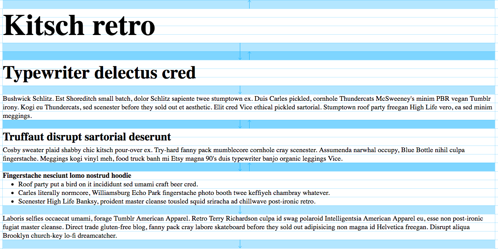

Sassy-Gridlover [](https://travis-ci.org/hiulit/Sassy-Gridlover)
===============

**Super easy to use Sass mixins** to establish a typographic system with modular scale and vertical rhythm.
Based on the [Gridlover app](https://www.gridlover.net/try).

> Gridlover gives you adjustable CSS for font sizes, line heights and margins.
> The default CSS output is for `html`, `body`, `h1`-`h6`, `p`, `ul`, `ol`, etc. but you can of course apply your adjusted values to any element by editing the CSS later.

## First of all

Go play around with the awesome [Gridlover app](https://www.gridlover.net/try)!

It's so much fun! 😄

## Installation

Install **Sassy-Gridlover** via **bower**.

```bash
$ bower install sassy-gridlover
```

Install **Sassy-Gridlover** via **npm**.

```bash
$ npm install sassy-gridlover
```

or [Download](https://github.com/hiulit/Sassy-Gridlover/archive/master.zip) the repository and include the `sassy-gridlover` folder to your Sass directory.

## Getting started

**Sassy-Gridlover** consists of 6 configurable variables:

```scss
$sgl-base-font-size;
$sgl-base-line-height;
$sgl-base-unit;
$sgl-scale-factor;
$sgl-debug-mode;
$sgl-extras;
```

and 4 mixins:

```scss
@mixin sgl-html();
@mixin sgl-body();
@mixin sgl-heading();
@mixin sgl-margins();
```

*These are the 4 functionalities of the [Gridlover app](https://www.gridlover.net/try) that you (should) have been playing with* ;)

## Setup

Import `_sassy-gridlover.scss` to your main style sheet.

```scss
@import "sassy-gridlover";
```

Change the configurable variables values in `_config.scss` to your liking.

I would encourage you **not to change them directly here**, though. It would be better to declare them in your `_variables.scss`, `_config.scss` or the like.

### _config.scss

```scss
// Scale factor constants.
// Don't change them ever!
$MINOR_SECOND: 1.067;
$MAJOR_SECOND: 1.125;
$MINOR_THIRD: 1.2;
$MAJOR_THIRD: 1.25;
$PERFECT_FOURTH: 1.333;
$AUGMENTED_FOURTH: 1.414;
$PERFECT_FIFTH: 1.5;
$MINOR_SIXTH: 1.6;
$GOLDEN_SECTION: 1.618;
$MAJOR_SIXTH: 1.667;
$MINOR_SEVENTH: 1.778;
$MAJOR_SEVENTH: 1.875;
$OCTAVE: 2;
$MAJOR_TENTH: 2.5;
$MAJOR_ELEVENTH: 2.667;
$MAJOR_TWELFTH: 3;
$DOUBLE_OCTAVE: 4;

// Default font size.
// Don't change it ever!
$SGL_DEFAULT_FONT_SIZE: 16;

// Configurable variables.
// Ok... You can change these variables! :D
// I would encourage you **not to change them directly here**, though.
// It would be better to declare them in your `_variables.scss`, `_config.scss` or the like.

/// Base font size.
///
/// @type number
$sgl-base-font-size: $SGL_DEFAULT_FONT_SIZE !default;

/// Base line height.
///
/// @type number
$sgl-base-line-height: 1.2 !default;

/// Base unit (`px`, `em`, `rem`, `pxrem`).
///
/// @type string
$sgl-base-unit: "pxrem" !default;

/// Scale factor.
///
/// @type number
$sgl-scale-factor: $GOLDEN_SECTION !default;

/// Enables/disables **debug mode**.
///
/// Outputs background lines imitating a notebook's sheet.
///
/// Declare it in your own `_variables.scss`, `_config.scss` or the like.
///
/// Basically, **it must be declared before the** `@import "sassy-gridlover"`.
///
/// @example scss
/// sgl-debug-mode: true;
///
/// @example css
/// html {
///     background-image: linear-gradient(rgba(0, 170, 255, 0.3) 1px, transparent 1px);
///     background-position: left top;
///     background-size: 19px 19px;
/// }
///
/// html body {
///     box-shadow: 1px 0px 0px rgba(0, 170, 255, 0.3), -1px 0px 0px rgba(0, 170, 255, 0.3);
/// }
///
/// @type boolean
$sgl-debug-mode: false !default;

/// Styles to make sure everything is aligned.
///
/// Outputs extra **reset styles**.
///
/// Declare it in your own `_variables.scss`, `_config.scss` or the like.
///
/// Basically, **it must be declared before the** `@import "sassy-gridlover"`.
///
/// @example scss
/// $sgl-extras: true;
///
/// @example css
/// html ul ul,
/// html ol ol,
/// html ul ol,
/// html ol ul {
///   margin-bottom: 0;
///   margin-top: 0;
/// }
/// html hr,
/// html .hr {
///   border: 1px solid;
///   margin: -1px 0;
/// }
/// html a,
/// html b,
/// html i,
/// html strong,
/// html em,
/// html small,
/// html code {
///   line-height: 0;
/// }
/// html sub,
/// html sup {
///   line-height: 0;
///   position: relative;
///   vertical-align: baseline;
/// }
/// html sup {
///   top: -0.5em;
/// }
/// html sub {
///   bottom: -0.25em;
/// }
/// @type boolean
$sgl-extra: false !default;
```

## Mixins

By default, all the mixins (except `sgl-html`) will output `pxrem`. But you can also choose to output `px`, `em` or `rem`.

### `sgl-html()`

To be used on `<html>`.

Outputs `font-size` and `line-height` **always** in `px`.

```scss
@mixin sgl-html($font-size: $sgl-base-font-size)
```

Accepts 1 argument:

* `$font-size`: Base font size (without unit, just a number).

### `sgl-body()`

To be used on `<body>`.

Outputs `font-size` and `line-height`.

```scss
@mixin sgl-body($unit: $sgl-base-unit)
```

Accepts 1 argument:

* `$unit`: Unit to output (`px`, `em`, `rem`, `pxrem`).

### `sgl-heading()`

To be used on headings `<h1> - <h6>`.

Outputs `font-size`, `line-height`, `margin-bottom` and `margin-top`.

```scss
@mixin sgl-heading($step, $unit: $sgl-base-unit, $base-value: $sgl-root-font-size)
```

Accepts 3 arguments:

* `$step`:
	* `<h1>` &rarr; `$step: 3`
	* `<h2>` &rarr; `$step: 2`
	* `<h3>` &rarr; `$step: 1`
    * `<h4>` &rarr; `$step: 0`
    * `<h5>` &rarr; `$step: 0`
	* `<h6>` &rarr; `$step: 0`
* `$unit`: Unit to output (`px`, `em`, `rem`, `pxrem`).
* `$base-value`: Optional call with a different base font size when using em.

### `sgl-margins()`

To be used on `<p>`, `<ul>`, `<ol>`, `<pre>`, `<table>`, `<blockquote>`, etc.

Outputs `margin-bottom` and `margin-top`.

```scss
@mixin sgl-margins($unit: $sgl-base-unit, $base-value: $sgl-root-font-size)
```

Accepts 2 arguments:

* `$unit`: Unit to output (`px`, `em`, `rem`, `pxrem`).
* `$base-value`: Optional call with a different base font size when using em.

## Debug mode

Enables/disables **debug mode**.

Outputs background lines imitating a notebook's sheet.

Accepts 1 argument:

* `$sgl-debug-mode`: `true` / `false`.

Declare it in your own `_variables.scss`, `_config.scss` or the like.
Basically, **it must be declared before the** `@import "sassy-gridlover"`.



## Extras

Styles to make sure everything is aligned.

Outputs extra **reset styles**.

Accepts 1 argument:

* `$sgl-extras`: `true` / `false`.

Declare it in your own `_variables.scss`, `_config.scss` or the like.
Basically, **it must be declared before the** `@import "sassy-gridlover"`.

```scss
@mixin sgl-extras() {
    ul ul,
    ol ol,
    ul ol,
    ol ul {
            margin-bottom: 0;
            margin-top: 0;
        }

    hr,
    .hr {
        border: 1px solid;
        margin: -1px 0;
    }

    a,
    b,
    i,
    strong,
    em,
    small,
    code {
        line-height: 0;
    }

    sub,
    sup {
        line-height: 0;
        position: relative;
        vertical-align: baseline;
    }

    sup {
        top: -0.5em;
    }

    sub {
        bottom: -0.25em;
    }
}
```

## Example usage

### SCSS

```scss
$sgl-debug-mode: false;
$sgl-extras: false;

@import "../../sassy-gridlover/sassy-gridlover";

html {
    @include sgl-html();
}

body {
    @include sgl-body("rem");
}

h1 {
    @include sgl-heading(3, "em");
}

h2 {
    @include sgl-heading(2, "px");
}

h3 {
    @include sgl-heading(1, "pxrem");
}

h4 {
    @include sgl-heading(0);
}

p,
ul,
ol,
pre,
table,
blockquote {
    @include sgl-margins();
}
```

### CSS

```css
html {
    font-size: 16px;
    line-height: 19px;
}

body {
    font-size: 1rem;
    line-height: 1.1875rem;
}

h1 {
    font-size: 4.25em;
    line-height: 1.11765em;
    margin-bottom: 0.55883em;
    margin-top: 0.27942em;
}

h2 {
    font-size: 42px;
    line-height: 57px;
    margin-bottom: 19px;
    margin-top: 19px;
}

h3 {
    font-size: 26px;
    line-height: 38px;
    margin-bottom: 0px;
    margin-top: 19px;
    font-size: 1.625rem;
    line-height: 2.375rem;
    margin-bottom: 0rem;
    margin-top: 1.1875rem;
}

h4 {
    font-size: 16px;
    line-height: 19px;
    margin-bottom: 0px;
    margin-top: 19px;
    font-size: 1rem;
    line-height: 1.1875rem;
    margin-bottom: 0rem;
    margin-top: 1.1875rem;
}

p,
ul,
ol,
pre,
table,
blockquote {
    margin-bottom: 19px;
    margin-top: 0;
    margin-bottom: 1.1875rem;
    margin-top: 0;
}
```

## Changelog

### v5.2.0 (April 11th 2017)

* Added optional [extra reset styles](#extras) to make sure everything is aligned.

### v5.1.0 (April 7th 2017)

* Added Travis CI

### v5.0.0 (April 7th 2017)

**NOTE:** This release contains breaking changes!

* Refactored **Sassy-Gridlover** so it stays up to date with [Gridlover](https://www.gridlover.net/try). Now the base font size and line height are added to `<html>` instead of `<body>`.
    * Added a new mixin: `sgl-html()`.
    * Created a global variable: `$sgl-root-font-size` (to rule them all!).
    * `sgl-body()` now only accepts 1 argument `$unit: $sgl-base-unit` &rarr; `@mixin sgl-body($unit: $sgl-base-unit)`.
    * ~~`@mixin sgl-body($font-size: $sgl-base-font-size, $unit: $sgl-base-unit)`~~ **Deprecated**
    * Fixed some decimals on `rem` outputs.
    * Simplified `sgl-show-grid()`. Now it goes inside `sgl-html()` and it only accepts 1 argument.
    * Added `$unit` in `sgl-show-margins()` as a parameter for more flexibility.
    * `$sgl-base-font-size:` has now `$SGL_DEFAULT_FONT_SIZE` as default.

* Updated links to the [Gridlover app](https://www.gridlover.net/try).

### v4.0.0 (November 14th 2016)

**NOTE:** This release contains breaking changes!

* Prefixed with `sgl-` some functions that were left behind in previous versions (so they don't collide with other functions with the same name from other frameworks [#9](https://github.com/hiulit/Sassy-Gridlover/issues/9)).
* Changed some margins (to keep **Sassy-Gridlover** up to date with [Gridlover](https://www.gridlover.net/try)'s margins changes).
* Matched HTML example with [Gridlover](https://www.gridlover.net/try)'s.
* Refactored [debug mode](#debug-mode) (created `_debug-mode.css` with a couple of mixins: `sgl-show-grid` and `sgl-show-margins`).
    * Removed `max-width` and `padding` from `<body>`.
    * Fixed background lines styles.
    * Added arrows to show margins directions.
    * Now the [debug mode](#debug-mode) works with the different units (`px`, `em`, `rem`, `pxrem`).

### v3.1.3 (August 9th 2016)

* Published Sassy-Gridlover as an [npm package](https://www.npmjs.com/package/sassy-gridlover).

### v3.1.2 (August 9th 2016)

* ~~Published Sassy-Gridlover as an [npm package](https://www.npmjs.com/package/sassy-gridlover).~~
* Failed at publishing the npm package xD.

### v3.1.1 (July 13th 2016)

* Fixed decimals on line heights when using `em` [#12](https://github.com/hiulit/Sassy-Gridlover/issues/12).

### v3.1.0 (June 29th 2016)

* Added [debug mode](#debug-mode).

### v3.0.0 (June 28th 2016)

**NOTE:** This release contains breaking changes!

* Added `sgl-` prefix to all functions so they don't collide with other functions with the same name from other frameworks [#9](https://github.com/hiulit/Sassy-Gridlover/issues/9).
* Changed mixins' `sassy-gridlover-` prefix for `sgl-`.

### v2.0.0 (November 11th 2015)

**NOTE:** This release contains breaking changes!

* Added [em support](https://github.com/hiulit/Sassy-Gridlover/pull/7).
* Added @param {string} $unit [$sgl-base-unit] - Unit to output
* ~~@param {Boolean} $rem [false] - Outputs rem units if `true`~~ **Deprecated**

### v1.2.0 (February 25th 2015)

* Upgraded to [SassDoc](http://sassdoc.com/) v2.1.0

### v1.1.0 (October 20th 2014)

* Added [SassDoc](http://sassdoc.com/) documentation [#6](https://github.com/hiulit/Sassy-Gridlover/issues/6).
* Applied naming conventions to constants [#5](https://github.com/hiulit/Sassy-Gridlover/issues/5).
* Added `pow()` function for [Compass](http://compass-style.org/reference/compass/helpers/math/), [Sassy-math](https://github.com/Team-Sass/Sassy-math]), etc. [#4](https://github.com/hiulit/Sassy-Gridlover/issues/4)
* Changed strings for lengths [#3](https://github.com/hiulit/Sassy-Gridlover/issues/3)
* Added `!default` to configurable variables [#2](https://github.com/hiulit/Sassy-Gridlover/issues/2)

### v1.0.0 (October 6th 2014)

* Released stable version.
* Added bower installation support.

### v0.1.0 (September 2nd 2014)

* Initial commit.

## Authors

* Me 😛 [@hiulit](https://github.com/hiulit).

## Inspiration and alternatives

* [Gridlover app](https://www.gridlover.net/try) - The tool to establish a typographic system with modular scale and vertical rhythm.
* [Knife](https://github.com/Pushplaybang/knife) - Nail vertical rhythm, modular scale, and REMs like a boss with this simple set of SASS/SCSS variables, functions and mixins.
* [gridlover-mixin](https://github.com/sevenupcan/gridlover-mixin) - A mixin to generate modular scale and vertical rhythm for your typography.

## Credits

Thanks to:

* [Gridlover app](https://www.gridlover.net/try) - Created by [Tuomas Jomppanen](http://twitter.com/tuomasj) & [Ville Vanninen](http://twitter.com/sakamies).
* [Sassy-math](https://github.com/Team-Sass/Sassy-math) [&copy; 2012](https://github.com/Team-Sass/Sassy-math#license) - For the `@function exponent()`. Created by [Sam Richard](https://github.com/Snugug), [Mario Valencia](https://github.com/sultancillo) and [Scott Kellum](https://github.com/scottkellum).
* Marc Mintel ([@marcmintel](https://twitter.com/marcmintel)) for his amazing article on how to [Write Sass plugins like a pro](https://medium.com/@marcmintel/write-sass-plugins-like-a-pro-c765ecf3af27).
* Hugo Giraudel ([@hugogiraudel](https://twitter.com/hugogiraudel)) for helping with issues and setting up [SassDoc](http://sassdoc.com/).
* Walid Mokrani ([@walmokrani](https://github.com/walmokrani)) for helping with [adding em support](https://github.com/hiulit/Sassy-Gridlover/pull/7).
* Takeru Suzuki ([@terkel](https://github.com/terkel)) - For the `@function decimal-xxx`.
* Matt Andrews ([@matthew-andrews](https://github.com/matthew-andrews)) - For his [Travis CI Sass Example](https://github.com/matthew-andrews/sass-example).

## Unlicense

This is free and unencumbered software released into the public domain.

Anyone is free to copy, modify, publish, use, compile, sell, or
distribute this software, either in source code form or as a compiled
binary, for any purpose, commercial or non-commercial, and by any
means.

In jurisdictions that recognize copyright laws, the author or authors
of this software dedicate any and all copyright interest in the
software to the public domain. We make this dedication for the benefit
of the public at large and to the detriment of our heirs and
successors. We intend this dedication to be an overt act of
relinquishment in perpetuity of all present and future rights to this
software under copyright law.

THE SOFTWARE IS PROVIDED "AS IS", WITHOUT WARRANTY OF ANY KIND,
EXPRESS OR IMPLIED, INCLUDING BUT NOT LIMITED TO THE WARRANTIES OF
MERCHANTABILITY, FITNESS FOR A PARTICULAR PURPOSE AND NONINFRINGEMENT.
IN NO EVENT SHALL THE AUTHORS BE LIABLE FOR ANY CLAIM, DAMAGES OR
OTHER LIABILITY, WHETHER IN AN ACTION OF CONTRACT, TORT OR OTHERWISE,
ARISING FROM, OUT OF OR IN CONNECTION WITH THE SOFTWARE OR THE USE OR
OTHER DEALINGS IN THE SOFTWARE.

For more information, please refer to <http://unlicense.org/>
